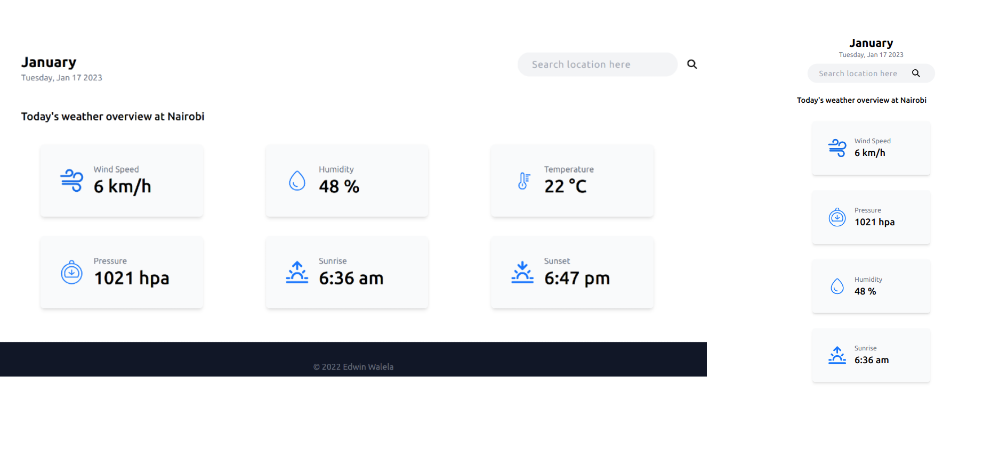

# Weather App

A weather web app which displays weather based on location

### Responsive Design



## Tech Stack

- ReactJS (TypeScript + Vite)
- React redux (redux toolkit)
- TailwindCSS

## Local development

Clone repository

```bash
git clone https://github.com/EdwinWalela/weatherapp
```

Install dependancies

```bash
cd weather-app && npm i
```

Create env file and register for an API Key at [Open Weather Map](openweathermap.org/current)

```
cp example.env .env
```

Start development server

```bash
npm run dev
```
